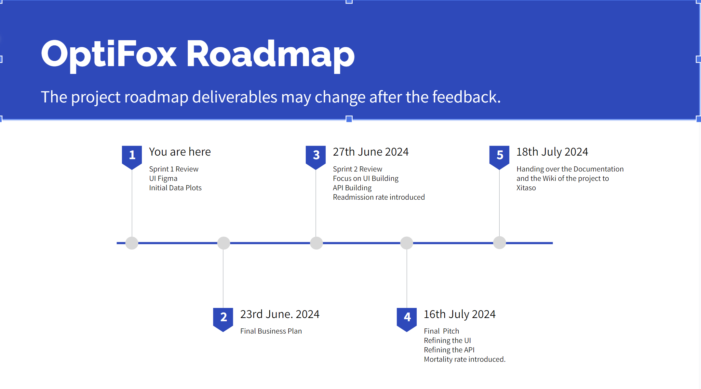

<h3 align="center">OptiFox(Xitaso)</h3>

  <p align="left">
    This project aims to build an innovative digital assistant designed to enhance decision-making in intensive care units (ICUs) through advanced predictive analytics.

  </p>
</div>


<!-- TABLE OF CONTENTS -->
<details>
  <summary>Table of Contents</summary>
  <ol>
    <li>
      <a href="#about-the-project">About The Project</a>
      <ul>
        <li><a href="#built-with">Built With</a></li>
      </ul>
    </li>
    <li>
      <a href="#getting-started">Getting Started</a>
      <ul>
        <li><a href="#prerequisites">Prerequisites</a></li>
        <li><a href="#installation">Installation</a></li>
      </ul>
    </li>
    <li><a href="#usage">Usage</a></li>
    <li><a href="#roadmap">Roadmap</a></li>
    <li><a href="#contributing">Contributing</a></li>
    <li><a href="#license">License</a></li>
    <li><a href="#contact">Contact</a></li>
    <li><a href="#acknowledgments">Acknowledgments</a></li>
  </ol>
</details>


## About The Project

Give a brief introduction into the project.


### Built With

* [] Python 3.10
* []
* []

<!-- CONTACT -->
### Contact

Project Link: [https://mad-srv.informatik.uni-erlangen.de/InnoLab/ss24/xitaso](https://mad-srv.informatik.uni-erlangen.de/InnoLab/ss24/xitaso)


<!-- GETTING STARTED -->
## Getting Started

### Prerequisites

This is an example of how to list things you need to use the software and how to install them.
* npm
  ```sh
  npm install npm@latest -g
  ```

### Installation

1. Get a free API Key at [https://example.com](https://example.com)
2. Clone the repo
   ```sh
   git clone https://github.com/github_username/repo_name.git
   ```
3. Install NPM packages
   ```sh
   npm install
   ```
4. Enter your API in `config.js`
   ```js
   const API_KEY = 'ENTER YOUR API';
   ```

<!-- USAGE EXAMPLES -->
## Project Structure
Give a brief overview of the project's structure by visualising the (sub-)folder structure and how files interact with each other.

 ```
Optifox/
├── code/
│ ├── server.py
│ ├── templates/
│ │ └── patient_page.html
│ └── static/
│ ├── css/
│ │ └── styles.css
│ └── js/
│ └── script.js
├── data/
├── models/
├── references/
├── reports/
├── src/
├── tests/
│ └── test_server.py
├── requirements.txt
├── .devcontainer/
├── Dockerfile
├── README.md
```

- **code/**: Directory for the project's source code.
    - **server.py**: Contains the Flask application code.
    - **templates/**: Directory for HTML templates.
    - **static/**: Directory for static files like CSS and JavaScript.
        - **css/**: CSS files for styling.
        - **js/**: JavaScript files for interactivity.
- **data/**: Directory for data files used in the project (MIMIC IV).
- **models/**: Directory for machine learning models or other saved models.
- **references/**: Directory for reference materials or documentation.
- **reports/**: Directory for project reports or documentation.
- **src/**: Directory for any additional source code or libraries to produce preprocessing data.
- **tests/**: Directory for test cases.
    - **test_server.py**: Test cases for the Flask application.
- **requirements.txt**: File containing dependencies required to run the project.
- **.devcontainer/**: Directory containing configuration files for development container settings.
- **Dockerfile**: File containing instructions to build a Docker image for the project.
- **README.md**: Documentation for the project.

<!-- ROAD MAP -->
## Project Road map




<!-- LICENSE -->
## License

Distributed under the MIT License. See `LICENSE.txt` for more information.


<p align="right">(<a href="#readme-top">back to top</a>)</p>
